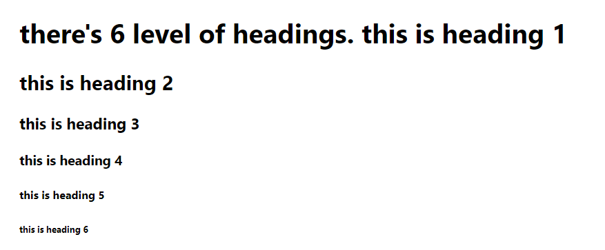

# webDevBasic
learning webdev
basic knowledge that would help u to use html
##1 Header
```
<h1>there's 6 level of headings. this is heading 1</h1>
    <h2>this is heading 2</h2>
    <h3>this is heading 3</h3>
    <h4>this is heading 4</h4>
    <h5>this is heading 5</h5>
    <h6>this is heading 6 </h6>
```


## Paragraph and Style
```
    <p>these are paragraph Lorem ipsum dolor sit amet consectetur, adipisicing elit. Accusantium aperiam facilis doloremque. <br>

        Bold <b> Highlight important information</b><br>
        Strong <strong>Similarly to bold, to highlight key text</strong><br>
        Italic <i>To denote text</i><br>
        Emphasised Text <em>	Usually used as image captions</em><br>
        Marked Text <mark>	Highlight the background of the text</mark><br>
        Small Text <small> To shrink the text</small><br>
        Strike <strike>Striked Out Text	To place a horizontal line across the text</strike><br>
        Underlined Text <u>	Used for links or text highlights</u><br>
        Inserted Text	Displayed with an underline to show an inserted text<br>
        Subscript Text	<sub>Typographical stylistic choice</sub><br>
        Superscript Text <sup>Another typographical presentation style</sup><br>
    </p>
```

## Anchor
```
<a href="https://github.com/EnvyTia/">EnvyTia Github</a>
```
The first part of the attribute points to the page that will open once the link is clicked.

Meanwhile, the second part of the attribute contains the text which will be displayed to a visitor in order to entice them to click on that link.

another similiar method works on adding images such
```

```

## List
#### Ordered list
```
<ol>
<li>An item </li>
<li>Another item </li>
<li>Another goes here </li>
</ol>
```
#### Unordered list
also known as "bullet point" list
```
<ul> 
<li>This is </li> 
<li>An Unordered </li> 
<li>List </li> 
</ul>
```
#### Definition list
```
<dl>
<dt>Item</dt>
<dd>The definition goes here</dd>
</dl>
```